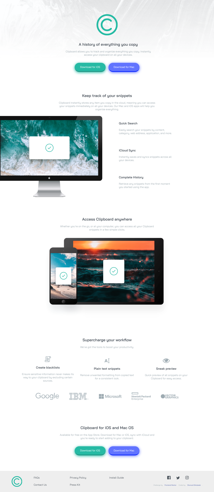

# Frontend Mentor - Clipboard landing page solution

This is a solution to the [Clipboard landing page challenge on Frontend Mentor](https://www.frontendmentor.io/challenges/clipboard-landing-page-5cc9bccd6c4c91111378ecb9). Frontend Mentor challenges help you improve your coding skills by building realistic projects.

## Table of contents

- [Overview](#overview)
  - [The challenge](#the-challenge)
  - [Screenshot](#screenshot)
  - [Links](#links)
- [My process](#my-process)
  - [Built with](#built-with)
  - [What I learned](#what-i-learned)
  - [Useful resources](#useful-resources)
- [Author](#author)

## Overview

### The challenge

Users should be able to:

- View the optimal layout for the site depending on their device's screen size
- See hover states for all interactive elements on the page

### Screenshot



### Links

- Solution URL: [https://github.com/shElkhateeb/clipboard-landing-page-master](https://github.com/shElkhateeb/clipboard-landing-page-master)
- Live Site URL: [https://shelkhateeb.github.io/clipboard-landing-page-master/](https://shelkhateeb.github.io/clipboard-landing-page-master/)

## My process

### Built with

- Semantic HTML5 markup
- CSS custom properties
- Flexbox
- CSS Grid

### What I learned

```html
<svg class="logo" viewBox="0 0 125 125">
  <image href="./images/logo.svg" />
</svg>
```

```css
footer .social a:nth-child(3):hover {
  filter: invert(28%) sepia(62%) saturate(2216%) hue-rotate(315deg) brightness(
      96%
    ) contrast(91%);
  -webkit-filter: invert(28%) sepia(62%) saturate(2216%) hue-rotate(315deg)
    brightness(96%) contrast(91%);
}
```

### Useful resources

- [How to change the color of an svg element?](https://stackoverflow.com/questions/22252472/how-to-change-the-color-of-an-svg-element) - This helped me with changing the colors of social media icons when hovering over them.
- [How to Scale SVGs-video](https://www.youtube.com/watch?v=Clv_YhMWoFk) - This video helped me in scaling the logo in the footer.
- [How to Resize a SVG image ?](https://www.geeksforgeeks.org/how-to-resize-a-svg-image/) - This teached me to use svg element to scale logo without making changes to the logo.svg file.
- [[ Html5 In Arabic ] #32 - SVG - Introduction](https://www.youtube.com/watch?v=EyLfC7BOPHo) and the next videos helped me understand the concept of svg.

## Author

- Frontend Mentor - [@shElkhateeb](https://www.frontendmentor.io/profile/shElkhateeb)
